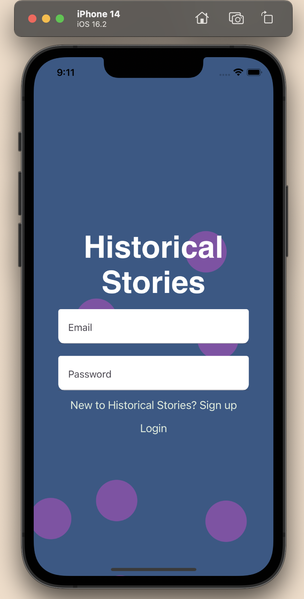
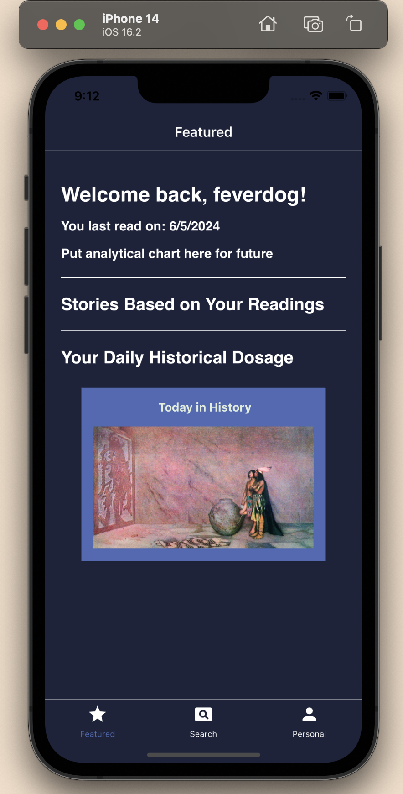
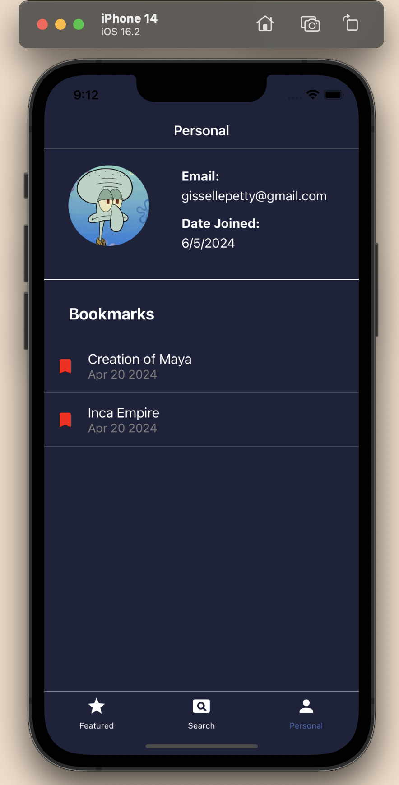
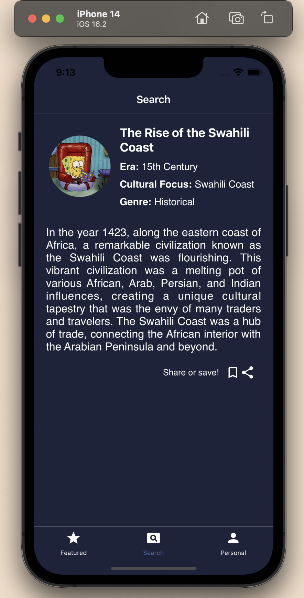
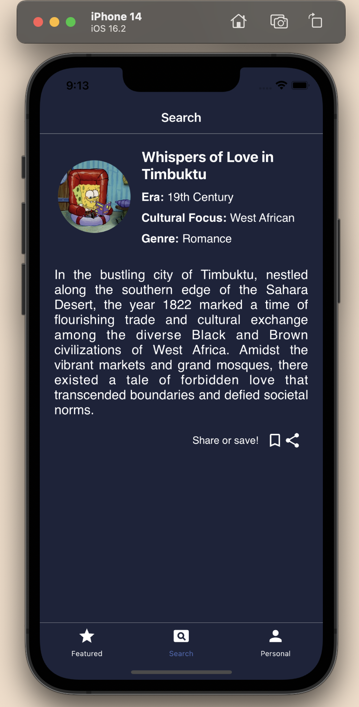

# Historical Stories

## Description

Historical Stories is an app that centers on Black and Brown stories. Many of our stories get wiped out due to colonization and imperialism, which is why this app focuses on these stories to preserve and teach our traditions. The app allows users to explore various genres such as Action, Romance, Mystery, Science, Betrayal, Happy-Endings, and LGBTQ+.

_Historical Stories is currently moving away from AI generated stories. Instead, this app will use crowdsourced stories that are told orally by history professionals, family, and friends. The OpenAI API will only organize, assist with writing more detailed stories, and cater to users' needs_

## Table of Contents

- [Installation](#installation)
- [Usage](#usage)
- [Images](#images)
- [Contributing](#contributing)
- [License](#license)
- [Acknowledgements](#acknowledgements)

## Installation

### Prerequisites

- Node.js
- Express
- Axios
- MongoDB
- OpenAI API
- React Native CLI

### Steps

1. Clone the repository

   ```sh
   git clone https://github.com/yourusername/historical-stories-app.git
   cd historical-stories-app
   ```

2. Install dependencies

   ```sh
   npm install

   yarn add express

   yarn add axios

   yarn add mongoose

   yarn add openai

   ```

3. Set up environment variables (create a `.env` file in the root directory and add the necessary environment variables).

```env
USERNAME=
PASSWORD=
MONGODB_URI=
LOCAL_HOST=
OPENAI_API_KEY=

```

4. Start the development server

```sh
npm start
```

5. Follow React Native's instructions for running on [Android](https://reactnative.dev/docs/running-on-device) or [iOS](https://reactnative.dev/docs/running-on-device).

## Usage

1. **Signup/Login**: Users can sign up and log in to access personalized features.
2. **Explore Stories**: Browse and read stories based on different genres and cultural focuses. (Search is still currently in the works)
3. **Bookmark Stories**: Save favorite stories for easy access later.
4. **User Profile**: Manage user profile and view reading statistics.

Example API request to fetch user profile:

```javascript
fetch("/api/user/profile", {
  method: "GET",
  headers: {
    Authorization: `Bearer ${token}`,
  },
})
  .then((response) => response.json())
  .then((data) => console.log(data))
  .catch((error) => console.error("Error:", error));
```

## Images

_The images below showcase content generated using OpenAI's API to create stories that focus on Black and Brown narratives._








## Contributing

Historical Stories is dedicated to preserving and sharing the rich cultural narratives of Black and Brown communities. Our primary focus is on collecting stories from the following groups:

- African and African American
- Armenian
- Arab
- Filipino
- Mexican and Latin American
- Indian
- Vietnamese
- Indonesian
- Indigenous peoples of New Zealand
- Thai

If you'd like to participate and share stories on your ancestry, please contact [Gisselle Petty](gissellepetty@gmail.com) to schedule a coffee chat.

See also, the [AirTable file](https://airtable.com/appSMj8R9vlZ5uev5/paggSlZfvYothcIpt/form) where we categorize and collect our stories.

## License

This project is licensed under the Apache-2.0 License. See the LICENSE file for details.

## Acknowledgements

Inspired by the rich histories of Black and Brown communities.
